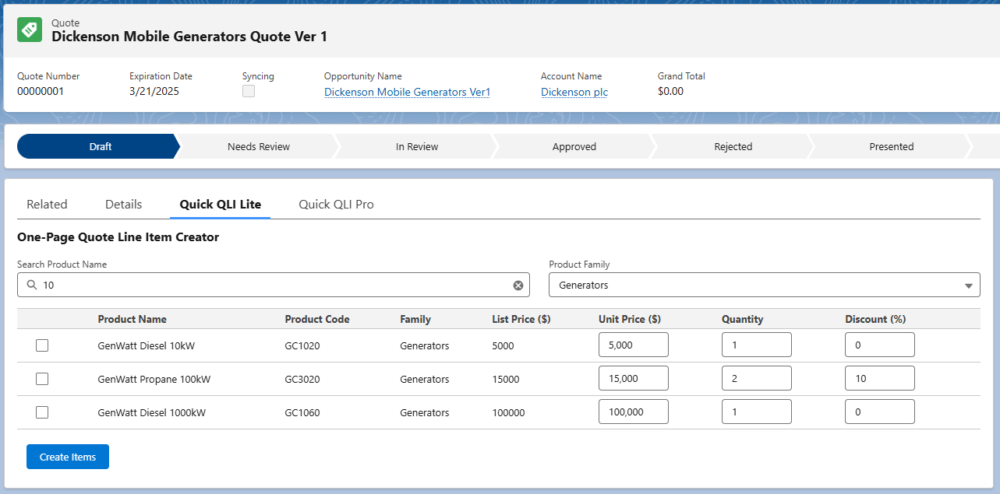

# ⚡ Quick QLI Lite

**Quick QLI Lite** is a lightweight, one-page Quote Line Item (QLI) creator for Salesforce Lightning Experience. Designed for speed and simplicity, it enables users to quickly add multiple Quote Line Items to a Quote without switching pages or opening modals.



## ✨ Features

- 🔍 **Search-as-you-type** product lookup
- 📂 **Product Family dropdown** filtering
- 🧾 **Inline editing** of:
  - Unit Price
  - Quantity
  - Discount (%)
- ☑️ **Checkbox selection** for multiple Quote Line Items
- 📤 **One-click "Create Items"** button to submit selected rows
- 💡 **List Price reference** displayed for user clarity
- 🧩 **Built 100% in LWC** – no dependency on `lightning-datatable`
- 🚀 **Fast, minimal, and clean** design for Quote creation flow

---

## 📁 Folder Structure

```
quickqli-lite/
├── deployment/            # Deployment instructions and metadata
├── force-app/             # LWC source files
├── screenshots/           # UI screenshots (e.g. ui-overview.png)
├── README.md              # You're here!
└── LICENSE                # MIT License
```

---

## 🔐 Want More Power?

The **Pro Version** includes:
- Live row & total calculations
- Pagination (Next/Back)
- Sorting with memory across pages
- Advanced filtering and row selection via checkboxes
- Right-aligned currency formatting based on locale
- Enhanced UI polish
- 💼 Enterprise-level support & integration service

👉 [Buy QuickQLI Pro on Gumroad](https://sivanirina.gumroad.com/l/quickqli)

---

## 🛠 Installation (Lite)
1. Unzip the code
2. Deploy via Salesforce CLI or use Developer Console. Or use the metadata zip file in the `deployment/` folder with Salesforce Workbench.
3. Add to your Lightning Page or Utility Bar

---

## 📄 License
This project is licensed under the MIT License.  
**Author:** Iryna Zasikan  
**Contact:** iryna.zasikan@gmail.com

---

## 📸 Screenshots

| Product Search & Selection |
|----------------------------|
|  |

## 🛠️ Requirements

- Salesforce DX enabled org
- Lightning Experience
- Products & Pricebooks set up

## 🧾 License

MIT License – see [LICENSE](./LICENSE) file for details.

---

© 2025 [Iryna Zasikan](mailto:iryna.zasikan@gmail.com)
